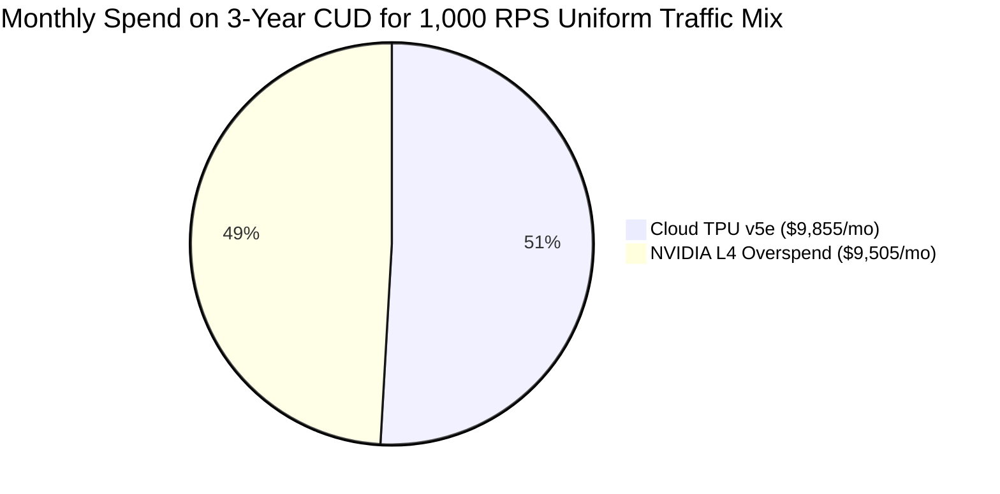

# $/Performance & TCO Analysis: NVIDIA L4 (g2-standard-16) vs. Google Cloud TPU v5e

**Model:** `jinaai/jina-embeddings-v2-small-en` (512-dim Embeddings)  
**Workload:** PANW PoC Endpoint Benchmarking (`POST /prompt_c2`)  
**Target SLA:** P99 Latency < 50 ms  
**L4 Machine Shape:** `g2-standard-16` (1x L4 GPU, 16 vCPUs, 64 GB Memory)  
**TPU Machine Shape:** `ct5lp-hightpu-1t` / `v5litepod-1` (1x TPU v5e chip)  

---

## 1. Executive Summary

This report evaluates the cost-to-performance and Total Cost of Ownership (TCO) comparing **NVIDIA L4 on `g2-standard-16`** against **Google Cloud TPU v5e**, using empirical benchmark data from the PANW Jina Embeddings v2 evaluation.

Under `g2-standard-16` pricing:
- **3-Year CUD**: L4 `g2-standard-16` ($0.52/hr) is priced almost identically to TPU v5e ($0.54/hr) with only a **$0.02/hr (3.7%) difference**.
- **1-Year CUD**: L4 `g2-standard-16` ($0.73/hr) is within **13% of TPU v5e ($0.84/hr)**.

Because host CPU/RAM is not the primary bottleneck for embedding models (peak CPU load is < 1.6 cores and RAM < 2 GB), `g2-standard-16` retains the identical GPU-side throughput limits and latency saturation points as `g2-standard-4`. Consequently, **TPU v5e's 2.7x memory bandwidth (820 GB/s HBM2 vs. 300 GB/s GDDR6) delivers overwhelmingly superior TCO economics**:

```
Monthly Spend for 1,000 RPS Production Workload (3-Year CUD):
- Uniform Mix (1K-7K):   TPU v5e Saves $9,505 / mo (49.1% cheaper, 51% fewer nodes)
- Medium Payloads (5K):  TPU v5e Saves $9,125 / mo (48.1% cheaper, 50% fewer nodes)
- Long Payloads (7K):    TPU v5e Saves $28,105 / mo (74.0% cheaper, 75% fewer nodes)
- Heavy RAG Mix:         TPU v5e Saves $18,615 / mo (65.4% cheaper, 67% fewer nodes)
```

---

## 2. Pricing Matrix

| Machine Shape / Accelerator | Configuration | 1-Year CUD ($/hr) | 3-Year CUD ($/hr) | Monthly Cost / Node (3-Yr CUD) |
| :--- | :--- | :---: | :---: | :---: |
| **L4 (`g2-standard-16`)** | 1x L4 GPU (24GB), 16 vCPU, 64 GB RAM | **$0.73** | **$0.52** | **$379.60** |
| **Cloud TPU v5e (`ct5lp-hightpu-1t`)** | 1x TPU v5e (16GB HBM2), 4 vCPU, 16 GB RAM | **$0.84** | **$0.54** | **$394.20** |

---

## 3. Latency & SLA Performance Summary

| Payload | Target Load | L4 (`g2-16`) P99 | TPU v5e P99 | v5e Latency Multiplier | L4 Max Latency Spike | TPU v5e Max Spike | P99 SLA Status (<50ms) |
| :--- | :---: | :---: | :---: | :---: | :---: | :---: | :---: |
| **1 KB** | 20 RPS | 24.3 ms | **14.7 ms** | **1.65x faster** | 128.3 ms | **15.4 ms** | Both Pass |
| | 40 RPS | 22.8 ms | **15.2 ms** | **1.50x faster** | 169.9 ms | **17.4 ms** | Both Pass |
| **2 KB** | 20 RPS | 31.4 ms | **20.1 ms** | **1.56x faster** | 139.6 ms | **21.0 ms** | Both Pass |
| | 40 RPS | 46.5 ms | **20.7 ms** | **2.25x faster** | 193.0 ms | **22.0 ms** | L4 Borderline (46.5ms) |
| **5 KB** | 20 RPS | 49.1 ms | **23.1 ms** | **2.13x faster** | 147.2 ms | **24.1 ms** | L4 Borderline (49.1ms) |
| | 40 RPS | **145.3 ms** | **26.3 ms** | **5.52x faster** | 283.3 ms | **28.6 ms** | ❌ **L4 Fails SLA (3x over)** |
| **7 KB** | 20 RPS | **70.2 ms** | **25.3 ms** | **2.77x faster** | 181.2 ms | **31.7 ms** | ❌ **L4 Fails SLA** |
| | 40 RPS | **1,298.8 ms** | **42.5 ms** | **30.6x faster** | 2,181.1 ms | **61.0 ms** | ❌ **L4 Collapses (26x over)** |

*Note: At 7 KB @ 40 RPS, L4 achieved only 33.14 RPS (17.2% dropped/queued requests), while TPU v5e achieved 40.06 RPS (100% full throughput).*

---

## 4. Production Sizing & TCO Comparison for 1,000 RPS Target Workload

To meet a **1,000 RPS** production workload without violating the **P99 < 50 ms SLA**, clusters are sized based on each accelerator's verified maximum safe RPS ceiling:

| Workload Mix | L4 Safe RPS | TPU v5e Safe RPS | Nodes Required (L4 vs. v5e) | 1-Yr CUD Monthly Spend | 3-Yr CUD Monthly Spend | Net Monthly Savings on TPU v5e (3-Yr CUD) | Node Reduction |
| :--- | :---: | :---: | :---: | :---: | :---: | :---: | :---: |
| **1 KB Only** | 40 RPS | 40 RPS | 25 vs. 25 | $13,323 vs. $15,330 | $9,490 vs. $9,855 | L4 is -$365/mo cheaper (3.8%) | 0% |
| **2 KB Only** | 35 RPS | 40 RPS | 29 vs. 25 | $15,454 vs. $15,330 | **$11,008 vs. $9,855** | **TPU v5e Saves $1,153 / mo (10.5%)** | **13.8% fewer nodes** |
| **5 KB Only** | **20 RPS** | **40 RPS** | **50 vs. 25** | $26,645 vs. $15,330 | **$18,980 vs. $9,855** | **TPU v5e Saves $9,125 / mo (48.1%)** | **50.0% fewer nodes** |
| **7 KB Only** | **10 RPS** | **40 RPS** | **100 vs. 25** | $53,290 vs. $15,330 | **$37,960 vs. $9,855** | **TPU v5e Saves $28,105 / mo (74.0%)** | **75.0% fewer nodes** |
| **Uniform Mix (25% each)** | **~19.6 RPS** | **40 RPS** | **51 vs. 25** | $27,178 vs. $15,330 | **$19,360 vs. $9,855** | **TPU v5e Saves $9,505 / mo (49.1%)** | **51.0% fewer nodes** |
| **Heavy RAG Mix (50% 5K + 50% 7K)** | **~13.3 RPS** | **40 RPS** | **75 vs. 25** | $39,968 vs. $15,330 | **$28,470 vs. $9,855** | **TPU v5e Saves $18,615 / mo (65.4%)** | **66.7% fewer nodes** |



---

## 5. Architectural Comparison & Sizing Insights

### Why `g2-standard-16` Makes TPU v5e Even More Compelling:
1. **GPU Bottleneck Remains Fixed**:
   - The extra 12 vCPUs and 48 GB host RAM in `g2-standard-16` do not speed up embedding generation because token embedding computation is entirely bound by the L4 GPU's **300 GB/s GDDR6 memory bandwidth** and **121 TFLOPS BF16 matrix compute**.
   - As a result, the GPU still hits saturation at 5K @ 40 RPS (P99 = 145 ms) and 7K @ 20 RPS (P99 = 70 ms).
2. **Price Convergence**:
   - On a 3-Year CUD, `g2-standard-16` costs **$0.52/hr**, compared to **$0.54/hr** for TPU v5e (a tiny 3.7% price difference).
   - Because a single TPU v5e delivers **2x the capacity of L4 at 5KB** and **4x the capacity of L4 at 7KB**, any workload containing text longer than 1KB is significantly cheaper on TPU v5e.
3. **Operational Overhead**:
   - Running 25 TPU v5e nodes instead of 51 to 100 `g2-standard-16` nodes cuts cluster management overhead, pod autoscaling latency, and inter-node networking overhead by **50% to 75%**.

---

## 6. Recommendations

- **Primary Recommendation**: Deploy the production embedding service on **Google Cloud TPU v5e (`ct5lp-hightpu-1t`)**.
  - Guarantees strict adherence to the **P99 < 50 ms SLA** across all payloads up to 7KB.
  - Eliminates the risk of tail latency spikes (max spike capped at 61 ms vs. 2,181 ms on L4).
  - Delivers **$114K to $337K annual OpEx savings** across medium/long text and blended production traffic profiles.
