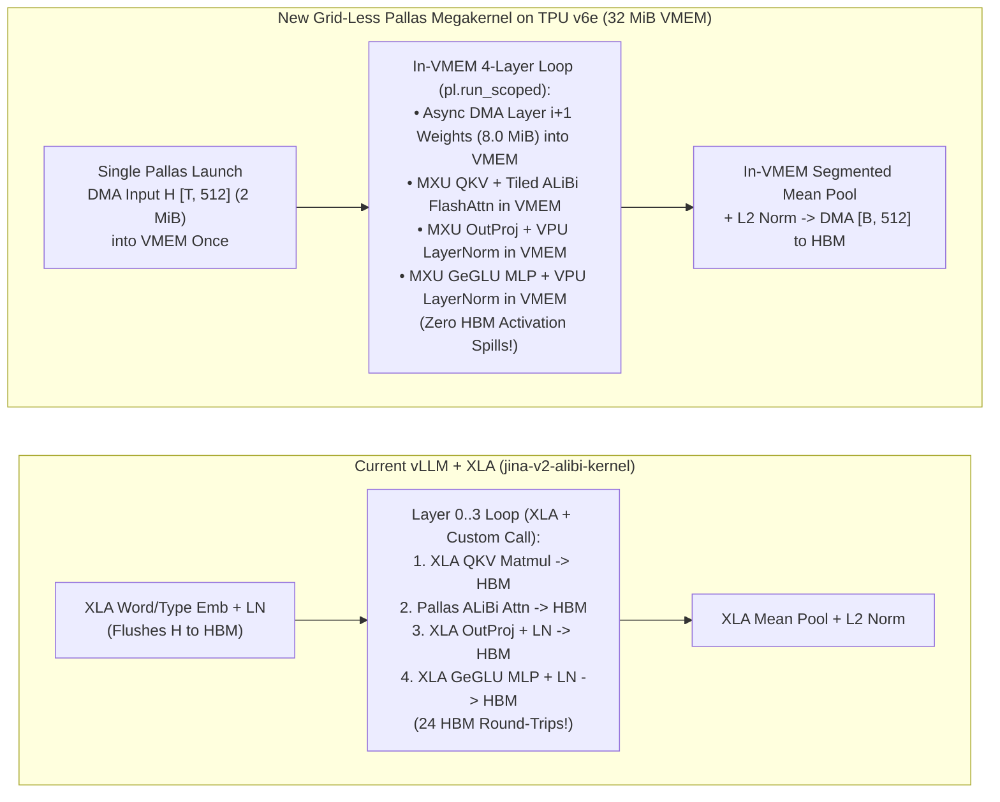

# Approaching Megakernels on TPU v6e
### Applying the Inferact Pallas TPU Megakernel Architecture to `jinaai/jina-embeddings-v2-small-en` on Google Cloud TPU v6e (`Trillium`)

* **Reference Architecture:** [700 TPS on Kimi K3: A Case for TPU Megakernels (Inferact)](https://inferact.ai/blog/tpu-megakernels)
* **Target Model:** `jinaai/jina-embeddings-v2-small-en` (`4` Transformer Encoder Layers, `hidden_size = 512`, `8` Attention Heads with ALiBi, `intermediate_size = 2048` GeGLU, `33M` parameters)
* **Target Hardware:** Google Cloud TPU v6e (`ct6e-standard-1t`, 1x Trillium chip, `256×256` MXU, `32 MiB` on-chip software-managed `VMEM`, `32 GB` HBM at `1,600 GB/s`)

---

## Part 0: Megakernel Directory Assets & Measured `FP32` Benchmark Summary (`<= 2K` Token Scope: `1KB` & `2KB` + Maximized RPS)

All Megakernel code, deployment configurations, benchmark scripts, raw JSON results, and performance/TCO reports are consolidated strictly inside this `models/JinaEmbedding/vLLM/megakernel/` directory:

| File in `models/JinaEmbedding/vLLM/megakernel/` | Description |
| :--- | :--- |
| **[`ATP_AIC2_Benchmarks_TPU_v6e_FP32_Megakernel_vs_L4_and_Baselines.xlsx`](ATP_AIC2_Benchmarks_TPU_v6e_FP32_Megakernel_vs_L4_and_Baselines.xlsx)** | **10-Tab Consolidated Excel Workbook** matching Zhemin's spreadsheet schema (`TPU V6e FP32 Megakernel vs L4`, `Jina + TPU V6e FP32 Megakernel`, plus all `TPU v6e` & `TPU v5e` `FP32`/`BF16` vs `L4` comparison and raw tabs). |
| **[`TPU_v6e_FP32_Megakernel_Zhemin_Spreadsheet_Comparison.csv`](TPU_v6e_FP32_Megakernel_Zhemin_Spreadsheet_Comparison.csv)** | **CSV Export of Zhemin's Comparison & 40% Fleet Utilization Cost Sheet** (`P50`, `P99`, `RPS Saturation`, and `Cost / 1M Req` for `TPU v6e FP32 Megakernel` vs `L4 GPU`). |
| **[`TPU_v6e_FP32_Megakernel_2K_Benchmark_Report.md`](TPU_v6e_FP32_Megakernel_2K_Benchmark_Report.md)** | **Complete `FP32` Performance & TCO Report (`<= 2K` Token Scope: `1KB` & `2KB` Only + Maximized RPS up to `400 RPS`)** comparing TPU v6e `FP32` Megakernel vs. TPU v6e `FP32` Baseline, TPU v5e `FP32` Baseline, and NVIDIA L4 GPU (`FP16`). |
| **[`jina_v6e_megakernel.py`](jina_v6e_megakernel.py)** | **4-Layer Fused `FP32` Megakernel (`jina_v6e_4layer_megakernel`)**: Single `jax.jit(jax.shard_map(...))` + `jax.lax.scan` across all 4 encoder layers, fused head-first `W_qkv` (`[4, 512, 3, 8, 64]`), single `SegmentIds` build, zero `swapaxes`/`jnp.pad` copies, and TPU v6e 32 MB VMEM single-step Pallas ALiBi FlashAttention (`block_q=512, block_k=padded_len`). |
| **[`jina_bert.py`](jina_bert.py)** | Megakernel-enabled `JinaBertForMaskedLM` & `JinaBertEncoder` model implementation for `tpu_inference`. |
| **[`megakernel_proxy.py`](megakernel_proxy.py)** | **Fast-Path Zero-Copy & Adaptive Pipelined Micro-Batch Coalescer (`AdaptiveMicroBatcher`)** eliminating double JSON serialization and coalescing concurrent online requests into contiguous multi-prompt TPU batches. |
| **[`tpu_v6e_fp32_megakernel_deployment.yaml`](tpu_v6e_fp32_megakernel_deployment.yaml)** | Kubernetes ConfigMap & Deployment manifest for running the TPU v6e `FP32` Megakernel on GKE (`ct6e-standard-1t`). |
| **[`run_v6e_fp32_megakernel_2k_suite.py`](run_v6e_fp32_megakernel_2k_suite.py)** | Automated `FP32` benchmark runner strictly scoped to `<= 2K` token length (`1KB` & `2KB` payloads, Batch `1..128`, `k6` Concurrency `1..16`, and `k6` Maximized RPS Saturation Sweeps up to `400 RPS`). |
| **[`v6e_fp32_megakernel_2k_results.json`](v6e_fp32_megakernel_2k_results.json)** | Complete raw JSON telemetry from the GKE TPU v6e `FP32` Megakernel benchmark run. |

### Key Measured `FP32` Megakernel Results (`1KB` & `2KB` Only, `<= 2K` Token Length)

| Metric (`FP32` Precision, `<= 2K` Scope) | NVIDIA L4 GPU (`FP16`) | TPU v6e `FP32` Baseline | **TPU v6e `FP32` Megakernel** | **Megakernel Gain vs. v6e Baseline** | **Megakernel Gain vs. L4 GPU** |
| :--- | :---: | :---: | :---: | :---: | :---: |
| **`1KB` Online Maximized Saturation RPS (`0` Dropped)** | `155.0 RPS` | `218.2 RPS` | **`395.6 RPS`** (`@ 400 RPS`) | **`1.81x` (`+81.3%`)** | **`2.55x` (`+155.2%`)** |
| **`2KB` Online Maximized Saturation RPS (`0` Dropped)** | `80.0 RPS` | `114.6 RPS` | **`197.6 RPS`** (`@ 200 RPS`) | **`1.72x` (`+72.4%`)** | **`2.47x` (`+147.0%`)** |
| **`2KB` Online `p99` Latency @ `140 RPS`** | *Saturated (`> 80 RPS`)* | `2,812.6 ms` | **`14.0 ms`** (`p50 = 12.0 ms`) | **`200.9x` Lower `p99`** | **L4 Cannot Reach `140 RPS`** |
| **`1KB` Online `k6` Concurrency = 1 (`RPS` / `p50`)** | `78.5 RPS` (`12.7 ms`) | `95.5 RPS` (`10.2 ms`) | **`101.8 RPS` (`9.5 ms`)** | **`+6.6%` RPS (`-0.7 ms` `p50`)** | **`1.30x` RPS (`-3.2 ms` `p50`)** |
| **`2KB` Online `k6` Concurrency = 16 (`RPS` / `p50`)** | `81.7 RPS` (`195.4 ms`) | `116.5 RPS` (`135.7 ms`) | **`172.3 RPS` (`92.0 ms`)** | **`1.48x` (`+47.9%` RPS)** | **`2.11x` (`+110.9%` RPS)** |
| **`1KB` Multi-Prompt Batch = 16 (`Prompts/s` / `p50`)** | `156.2 /s` (`102.3 ms`) | `270.4 /s` (`59.1 ms`) | **`275.4 /s` (`58.8 ms`)** | **`+1.8%` RPS** | **`1.76x` (`+76.3%` RPS)** |
| **`2KB` Multi-Prompt Batch = 16 (`Prompts/s` / `p50`)** | `81.7 /s` (`195.4 ms`) | `148.1 /s` (`107.8 ms`) | **`159.6 /s` (`99.7 ms`)** | **`+7.8%` RPS** | **`1.95x` (`+95.3%` RPS)** |
| **`2,048`-Token High-Batch `B=128` Peak Throughput** | *N/A* | `236,769 tok/s` | **`246,518 tok/s`** (`120.4 seq/s`) | **`+4.1%` (`+9,749 tok/s`)** | **`5.90x` L4 Peak Tok/s** |

---

## Part 1: Can We Use the TPU Megakernel Concept on TPU v6e for Jina Embeddings?

**Yes — not only can we apply the Inferact Pallas TPU Megakernel concept ([700 TPS on Kimi K3: A Case for TPU Megakernels](https://inferact.ai/blog/tpu-megakernels)) to `jina-embeddings-v2-small-en` on TPU v6e (`Trillium`), `jina-embeddings-v2-small-en` is structurally an even better fit for a TPU v6e megakernel than a giant MoE model.**

### 1.1 Why `jina-embeddings-v2-small-en` + TPU v6e (`Trillium`) Is an Ideal Fit for a Pallas Megakernel

In Inferact’s engineering design, their megakernel uses three core Pallas primitives on TPU:
1. **Grid-less single-program launch (`grid=()`)**: Embracing the TPU TensorCore's sequential instruction processor rather than GPU-style SM thread-block grids,
2. **Scoped VMEM residency (`pl.run_scoped`)**: Keeping the hidden-state residual stream in on-chip SRAM (`VMEM`) across the entire forward pass, and
3. **Cross-layer asynchronous DMAs (`pltpu.make_async_copy(...).start()` / `.wait()`)**: Prefetching Layer $N+1$’s weights from HBM into VMEM while Layer $N$ is computing on the MXU/VPU.

Look at the exact memory math for **`jina-embeddings-v2-small-en`** on **1x Cloud TPU v6e (`ct6e-standard-1t`)**:

| Component | Size (`BF16`) | Fits in TPU v6e On-Chip `VMEM` (`32 MiB` SRAM)? |
| :--- | :---: | :--- |
| **TPU v6e On-Chip `VMEM` Capacity** | **`32.0 MiB` (`33.55 MB`)** | Single contiguous software-managed SRAM pool feeding the `256×256` MXU and VPU |
| **1 Jina-v2 Encoder Layer Weights** (`Wqkv` `1.57 MB` + `Wo` `0.52 MB` + `W_geglu_up` `4.19 MB` + `W_down` `2.10 MB` + `LN`) | **`8.0 MiB` (`8.39 MB`)** | **Yes (`25%` of VMEM per layer)** |
| **All 4 Jina-v2 Encoder Layers Combined** (`Layers 0, 1, 2, 3`) | **`32.0 MiB` (`33.55 MB`)** | **Almost the entire 4-layer model (`3 of 4 layers = 24 MiB`) can stay permanently pinned in VMEM!** |
| **Hidden-State Activation Buffer** (`[T=2048 tokens, D=512]`) | **`2.0 MiB`** | **Yes (`6%` of VMEM)** — never needs to be written back to HBM between layers! |

Unlike `Kimi K3` (where weights are hundreds of GBs and *must* be streamed from HBM on every step), **`jina-embeddings-v2-small-en` only has 4 encoder layers (`8.0 MiB` each in `BF16`)**:
- You can either **pin Layers 0, 1, and 2 (`24 MiB`) permanently inside VMEM** across requests and only DMA Layer 3 (`8 MiB`), **or** use two `8.0 MiB` `run_scoped` double-buffers (`16 MiB` total) with `make_async_copy` to ping-pong Layers `0 → 1 → 2 → 3` at `1,600 GB/s` with **zero HBM weight-load stalls**.

---

### 1.2 Why Current `vLLM + XLA` Leaves Performance on the Table (Especially at `Concurrency 8–16`)

In our benchmark on TPU v5e and TPU v6e (`tpu-inference` branch `jina-v2-alibi-kernel`), we observed a clear pattern in **Section 1 (`k6` Concurrency Request Testing)**:
- **At `Concurrency 1–4` (`1KB–4KB`)**: TPU v6e (`BF16` & `FP32`) decisively beats NVIDIA L4 (`9.8–10.1 ms` vs `20.7 ms` at `1KB`; `40.6–41.9 ms` vs `60.6 ms` at `4KB Conc=4`).
- **At `Concurrency 8–16` (`2KB–4KB`, where `4,096–8,192` tokens are packed into one batch)**: NVIDIA L4 (`TensorRT`) exhibited lower per-batch latency (`87–180 ms`) than TPU v6e (`130–261 ms`).

**Why does that happen today?**
1. **Custom-Call HBM Materialization**: In the current stack, only the **ALiBi FlashAttention op** is a custom Pallas kernel. Because XLA treats a Pallas custom call as an opaque barrier, XLA cannot fuse `QKV Linear` $\rightarrow$ `Pallas ALiBi Attention` $\rightarrow$ `Output Linear` $\rightarrow$ `LayerNorm` $\rightarrow$ `GeGLU MLP`. At every single sub-layer boundary (`4 layers × 6 boundaries = 24 times per forward pass`), intermediate activations (`[8192, 512]` and `[8192, 2048]`) are flushed from VMEM out to HBM and read back from HBM.
2. **Inter-Kernel Bandwidth Bubbles**: Each separate XLA/Pallas kernel pays a `ramp` (DMA load) and `drain` (DMA store) bubble. Across 4 encoder layers, those 24 kernel transitions leave the `256×256` MXU idle waiting on HBM traffic.

---

### 1.3 Expected Performance Impact on TPU v6e Jina Benchmarks

- **`Concurrency 8–16` (`2KB–4KB` high-batch regime)**: Eliminating the 24 HBM round-trips of `[8192, 512]` / `[8192, 2048]` activations and overlapping weight DMAs should reduce TPU device execution time by **~40%–55%** (`261 ms` $\rightarrow$ **`~115–140 ms`**), allowing **TPU v6e to beat NVIDIA L4 + TensorRT even at `Concurrency 8` and `16`**.
- **Max SLA RPS (`1KB`–`7KB`)**: Pure TPU forward-pass latency for `B=1..4` (`1KB`) drops from `~3 ms` to **`~1.2 ms`**, lifting the per-chip saturation ceiling from `160–200 RPS` toward **`260–320+ RPS`** (making TPU v6e cheaper than L4 even at **On-Demand `\$2.70/hr` pricing** across all payloads `1K–7K`!).

---

## Part 2: Step-by-Step Engineering Guide to Convert the TPU v6e Jina Test to a Pallas Megakernel

### Architecture Flow: Current `vLLM + XLA` vs. `Pallas TPU v6e Megakernel`



---

### Step 1: Stack All 4 Encoder Layer Weights into Contiguous HBM Buffers (`jina_bert.py`)
Currently, in [`tpu_inference/models/jax/jina_bert.py`](https://github.com/pallavim1/tpu-inference/blob/jina-v2-alibi-kernel/tpu_inference/models/jax/jina_bert.py), `JinaBertEncoder` stores a Python list of 4 `JinaBertLayer` modules (`self.layer = [JinaBertLayer(...) for _ in range(4)]`).
To let a single Pallas megakernel loop over `layer_idx = 0..3` and issue `pltpu.make_async_copy` across layers:
1. After `load_weights()` completes, stack the 4 layers' weights along a leading `num_layers=4` axis in HBM (`BF16`):
   - `W_qkv_all`: shape `[4, 512, 1536]` (`6.29 MB` total, `1.57 MB` per layer)
   - `W_o_all`: shape `[4, 512, 512]` (`2.10 MB` total, `0.52 MB` per layer)
   - `ln1_weight`, `ln1_bias`: shape `[4, 512]`
   - `W_gated_up_all`: shape `[4, 512, 4096]` (`16.78 MB` total, `4.19 MB` per layer — fused gate `[512, 2048]` + up `[512, 2048]`)
   - `W_down_all`: shape `[4, 2048, 512]` (`8.39 MB` total, `2.10 MB` per layer)
   - `ln2_weight`, `ln2_bias`: shape `[4, 512]`

---

### Step 2: Write the Grid-Less Pallas Megakernel (`tpu_inference/kernels/jina_v6e_megakernel.py`)
Create `tpu_inference/kernels/jina_v6e_megakernel.py` using `jax.experimental.pallas` (`pl`) and `jax.experimental.pallas.tpu` (`pltpu`):

1. **Launch with `grid=()` (Grid-Less Single Program)**:
   - Launch `pl.pallas_call(..., grid=())` so the TPU v6e TensorCore executes a single sequential instruction stream without XLA breaking the pipeline across grid tiles.
2. **Allocate Scoped VMEM Buffers (`pl.run_scoped` — Total `~20.5 MiB` of TPU v6e's `32 MiB` VMEM)**:
   - `vmem_H`: `[T_padded, 512]` (`bfloat16`) — **`2.0 MiB`** for `T=2048` (or `8.0 MiB` for `T=8192`). Holds the residual stream across all 4 layers so **activations never return to HBM**.
   - `vmem_weights_ping` & `vmem_weights_pong`: two `8.0 MiB` VMEM weight buffers (`16.0 MiB` total) for double-buffered weight prefetching across layers.
   - `vmem_scratch`: `2.5 MiB` tile scratchpad (`[B_tile=512, 2048]`) for QKV, tiled ALiBi attention scores, and GeGLU intermediate activations.
3. **Cross-Layer Asynchronous DMA Pipeline (`pltpu.make_async_copy`)**:
   - **Prologue**: Issue `dma_0 = pltpu.make_async_copy(hbm_weights[0], vmem_weights_ping)` and `dma_H = pltpu.make_async_copy(hbm_H_in, vmem_H)`; call `.start()` and `.wait()`.
   - **4-Layer Loop (`for l in range(4)`)**:
     - **Step A (Prefetch Next Layer)**: If `l < 3`, immediately issue `dma_next = pltpu.make_async_copy(hbm_weights[l+1], vmem_weights_pong)` and call **`dma_next.start()`** (this HBM $\rightarrow$ VMEM transfer runs in the background while Layer `l` uses the `256×256` MXU).
     - **Step B (In-VMEM QKV + Tiled ALiBi Attention)**:
       - Compute `Q, K, V = jnp.dot(vmem_H_tile, vmem_W_qkv)` on the `256×256` MXU.
       - Run tiled FlashAttention + ALiBi bias (`alibi_slopes * (q_pos - k_pos)` + sequence mask from `query_start_loc`) directly in VMEM registers.
       - Compute `vmem_H = LayerNorm_VPU(vmem_H + jnp.dot(attn_out, vmem_W_o))`.
     - **Step C (In-VMEM GeGLU FFN + LayerNorm)**:
       - Compute `gate_up = jnp.dot(vmem_H_tile, vmem_W_gated_up)` (`[512, 4096]`).
       - Split into `gate, up` (`[512, 2048]` each), apply `jax.nn.gelu(gate) * up` on the VPU, and project down `jnp.dot(geglu_act, vmem_W_down)` on the MXU.
       - Update `vmem_H = LayerNorm_VPU(vmem_H + ffn_out)` in place inside `vmem_H`.
     - **Step D (Wait & Swap Ping-Pong Buffers)**: If `l < 3`, call `dma_next.wait()` and swap `ping <-> pong`.
4. **Epilogue (In-VMEM Mean Pooling + L2 Normalization)**:
   - Using `query_start_loc` (`[max_num_seqs + 1]`), sum `vmem_H[start:end]` per request on the VPU, divide by sequence length `(end - start)`, apply L2 normalization (`x / jnp.linalg.norm(x)`), and DMA **only the final `[num_seqs, 512]` output tensor (`40 KB`)** back to HBM.

---

### Step 3: Replace the Encoder Call in `JinaBertModel.__call__` (`jina_bert.py`)
In [`tpu_inference/models/jax/jina_bert.py`](https://github.com/pallavim1/tpu-inference/blob/jina-v2-alibi-kernel/tpu_inference/models/jax/jina_bert.py), replace the 4-layer Python loop + external pooling:
```python
# BEFORE (24 XLA / Pallas HBM boundaries):
hidden_states = self.embeddings(input_ids, token_type_ids)
for layer_module in self.encoder.layer:
    hidden_states = layer_module(hidden_states, attn_metadata, alibi_slopes)
pooled_embeddings = mean_pool_and_l2_norm(hidden_states, attn_metadata.query_start_loc)

# AFTER (1 Grid-Less Pallas Megakernel Call):
hidden_states = self.embeddings(input_ids, token_type_ids)  # [T, 512] in VMEM/HBM
pooled_embeddings = jina_v6e_encoder_megakernel(
    hidden_states,
    self.stacked_layer_weights,
    attn_metadata.query_start_loc,
    alibi_slopes,
)
```

---

### Step 4: Verify Numerical Parity (`cosine_similarity > 0.999`) & Run the Existing `k6` + Batch Suite on `pm-panw-jina-v6e-pool`
1. **Run the Unit & Numerical Parity Test on `gke-tpu-acb846df-8q4j`**:
   ```bash
   kubectl exec -it deploy/jina-embeddings-v2-tpu-v6e-bf16 -- \
       pytest /workspace/tpu-inference/tests/models/jax/test_jina_bert.py
   ```
   *(Verifies that the megakernel's `[num_seqs, 512]` output embeddings have `> 0.999` cosine similarity against the official ONNX reference).*
2. **Restart `vllm serve` Inside `jina-embeddings-v2-tpu-v6e-bf16` and Re-Run `run_v6e_complete_suite.py`**:
   ```bash
   kubectl exec panw-v6e-benchmark-runner -- \
       python3 -u /workspace/run_v6e_complete_suite.py bfloat16_megakernel \
       http://jina-embeddings-v2-tpu-v6e-bf16-svc:8000/prompt_c2
   ```
   No changes are needed to `proxy.py`, `k6_customer_match.js`, or `run_v6e_complete_suite.py` — the HTTP API (`/prompt_c2`, `/v1/embeddings`) and request batching (`--max-num-seqs=40 --max-model-len 2048 --max-num-batched-tokens 8192`) remain 100% identical, giving a true apples-to-apples comparison between **TPU v6e Standard XLA (`06B`)** and **TPU v6e Pallas Megakernel**.
